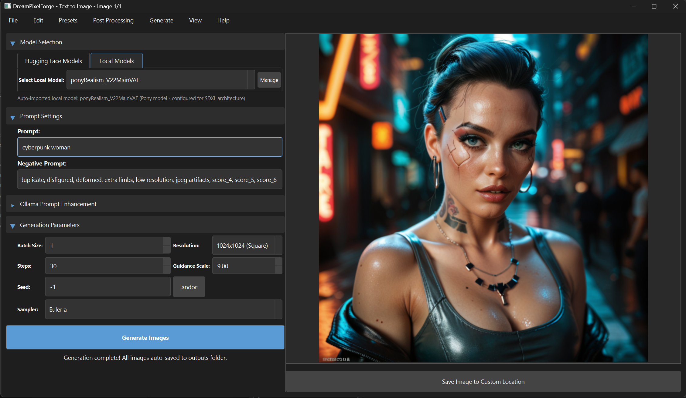

# DreamPixelForge

A modern GUI application for running multiple AI image generation models locally on your machine, transforming your text prompts into stunning images.



## Features

- Clean and intuitive user interface
- Multi-model support:
  - Stable Diffusion 1.5
  - Stable Diffusion 2.1
  - Stable Diffusion XL
  - Dreamlike Diffusion
  - Kandinsky 2.2
  - Pony Diffusion V6 XL
- Text-to-image generation with various models
- Support for negative prompts (model-specific defaults for optimal quality)
- Adjustable generation parameters (steps and guidance scale)
- Batch image generation (generate up to 10 images at once)
- Model-specific resolution presets
- **Automatic image saving to outputs folder**
- Save generated images in various formats
- Prompt enhancement using local LLMs via Ollama
- Seed control for reproducible results
- Multiple sampler algorithms for different generation styles
- **Cross-platform support** (Windows, macOS, Linux)
- GPU acceleration support where available (CUDA on Windows/Linux, Metal on macOS)
- Real-time progress tracking
- Clear feedback during model downloads
- Support for local models from Civitai and other sources
- **App Icon Generation** presets for professional icon creation
- **Icon Post-Processing** for rounded corners and platform-specific sizing

## Requirements

- Python 3.8 or higher
- For Windows/Linux: CUDA-capable GPU (recommended, 8+ GB VRAM for SDXL)
- For macOS: Apple Silicon Mac (M1/M2/M3) for Metal acceleration (Intel Macs will use CPU)
- At least 8GB of RAM (16GB recommended)
- 4-7GB free disk space per model (~20GB for all models)

## Installation

### Windows/Linux

1. Clone this repository:
   ```bash
   git clone https://github.com/yourusername/dream-pixel-forge.git
   cd dream-pixel-forge
   ```

2. Create a virtual environment (recommended):
   ```bash
   python -m venv venv
   source venv/bin/activate  # On Windows: venv\Scripts\activate
   ```

3. Install the required packages:
   ```bash
   pip install -r requirements.txt
   ```

### macOS

1. Clone this repository:
   ```bash
   git clone https://github.com/yourusername/dream-pixel-forge.git
   cd dream-pixel-forge
   ```

2. Use the provided installation script:
   ```bash
   chmod +x platform_specific/macos/install_macos.sh
   ./platform_specific/macos/install_macos.sh
   ```

   Or follow these manual steps:

3. Create a virtual environment (recommended):
   ```bash
   python -m venv venv
   source venv/bin/activate
   ```

4. Install the required packages:
   ```bash
   pip install -r requirements.txt
   ```

5. Notes for macOS:
   - Apple Silicon Macs (M1/M2/M3) will automatically use Metal Performance Shaders (MPS) for acceleration
   - Intel Macs will run in CPU mode (significantly slower)
   - Image generation will be slower than on equivalent NVIDIA GPUs

## Usage

1. Run the application:
   ```bash
   python dream_pixel_forge.py
   ```
2. Select the model you want to use:
   - Choose from the "Hugging Face Models" tab for pre-configured models
   - Or select from the "Local Models" tab for your own custom models
3. Enter your prompt in the text field
4. (Optional) Enter a negative prompt to specify what you don't want in the image
5. Adjust the generation parameters if needed:
   - Number of Steps: Higher values (30-50) generally produce better quality but take longer
   - Guidance Scale: Higher values (7.5-15) make the image more closely match the prompt
   - Batch Size: Number of images to generate at once (1-10)
   - Seed: Control the randomness of the generation
     - Use -1 for a random seed each time
     - Set a specific number for reproducible results
     - The random dice button generates a new random seed
   - Sampler: Select the algorithm used for the diffusion process
     - Different samplers have different characteristics and speeds
     - "Euler a" is a good default for most images
6. Click "Generate Images" and wait for the result
7. **All generated images are automatically saved** to the "outputs" folder, with filenames that include:
   - The first few words of your prompt
   - A unique generation counter
   - The seed used for the image
8. For batch generation:
   - Use the "Previous" and "Next" buttons to navigate between generated images
9. Use the "Save Image to Custom Location" button if you want to save your image to a specific location

## Models

### Stable Diffusion 1.5
The original Stable Diffusion model - fast and versatile.

### Stable Diffusion 2.1
Improved version with better quality and consistency.

### Stable Diffusion XL
Larger model with higher quality outputs (requires more VRAM).

### Dreamlike Diffusion
Artistic model that creates dreamlike, surreal images.

### Kandinsky 2.2
Russian alternative to SD with unique artistic style.

### Pony Diffusion V6 XL
Specialized model for creating stylized art with high quality outputs. This model uses the SDXL architecture and automatically applies quality-enhancing tags to prompts.

**Special features:**
- Optimal for generating stylized art
- Automatically applies quality boosting tags for better results
- Uses CLIP skip feature for improved output quality
- Based on SDXL, so needs 8+ GB VRAM for optimal performance

**Quality Score Tags:**
- All prompts for Pony Diffusion (both official and local models) are automatically enhanced with `score_9, score_8_up, score_7_up` quality tags
- These tags tell the model to generate high-quality images according to its internal aesthetic scoring system
- You don't need to add these tags manually - they're added automatically
- This applies to both the official Hugging Face model and any local Pony models you add

## Using Local Models

DreamPixelForge supports loading custom models from Civitai and other sources. These models should be in `.safetensors` or `.ckpt` format.

### Adding Local Models

1. There are two ways to add local models:
   - **Direct import**: Place `.safetensors` or `.ckpt` files in the `models` folder in the application directory and use "Import from Models Folder"
   - **Manual selection**: Use the "Add Model" button to select a model file from anywhere on your system

2. When adding a model, you'll need to provide:
   - **Model Name**: A name to identify the model in the UI
   - **Model Type**: The base model architecture (SD 1.5, SD 2.1, SDXL)
   - **Model File**: The path to the `.safetensors` or `.ckpt` file
   - **Description**: (Optional) A description of the model

3. After adding a model, it will appear in the "Local Models" tab

### Using Local Models

1. Switch to the "Local Models" tab
2. Select your model from the dropdown list
3. The appropriate resolution presets will be loaded based on the model type you specified
4. Generate images as you would with built-in models
5. Model-specific negative prompts will be automatically applied based on the model type

### Managing Local Models

Use the "Manage Models" button to:
- Add new models
- Import models from the models folder
- Remove models from the registry (this doesn't delete the model files)
- Auto-detection of Pony models with appropriate configuration

## App Icon Generation

DreamPixelForge includes specialized features for creating professional app icons:

### App Icon Generation Preset

1. Access the preset from the **Presets** menu → **App Icon Generator**
2. This applies optimal settings for app icon generation:
   - Square resolution (512x512 or 1024x1024 depending on model)
   - Optimal steps (25) and guidance scale (7.0)
   - Batch size of 4 to provide multiple options
   - Specialized negative prompt to avoid text and common artifacts
   - Sampler optimized for detailed icons

3. The preset also enhances your prompt by adding app icon specific terms if needed
4. You can then customize the prompt further to match your app's purpose

### App Icon Post-Processing

After generating your app icons, use the post-processing tool to prepare them for different platforms:

1. Generate an icon using the App Icon Preset
2. Go to **Post Processing** menu → **App Icon Processing**
3. In the dialog, set:
   - **Corner Radius** - Apply rounded corners from 0% (square) to 50% (fully rounded)
   - **Target Platform** - iOS, Android, Windows, macOS, or All Platforms
   - **Output Directory** - Where to save the processed icons

4. The tool automatically:
   - Applies the specified corner radius with proper transparency
   - Generates all required sizes for the selected platform
   - Names files according to platform conventions
   - Preserves transparency for platforms that support it

This workflow makes it easy to go from a text prompt to a complete set of properly sized and formatted icons for your application.

## Model-Specific Negative Prompts

DreamPixelForge now features optimized negative prompts for each supported model type:

- **Stable Diffusion 1.5**: Basic negative prompt to avoid common artifacts and issues
- **Stable Diffusion 2.1**: Extended negative prompt tailored to SD 2.1's characteristics
- **Stable Diffusion XL**: Comprehensive negative prompt optimized for SDXL models
- **Dreamlike Diffusion**: Special negative prompt for artistic models
- **Kandinsky 2.2**: Negative prompt adapted to Kandinsky's unique architecture
- **Pony Diffusion V6 XL**: Specialized negative prompt for stylized art generation

These model-specific negative prompts will be automatically applied when you switch between models, improving image quality without manual adjustment. You can still customize the negative prompt as needed for specific results.

## Automatic Model Detection

The application now automatically detects and properly configures certain model types:

- **Pony Models**: Automatically detected and configured as SDXL models with appropriate settings
- **Local Models**: Properly categorized based on their architecture (SD 1.5, SD 2.1, SDXL)

This ensures you get the best quality output with minimal manual configuration.

## Ollama Prompt Enhancement

DreamPixelForge supports prompt enhancement using local large language models via the Ollama project. This feature helps you:

1. Convert descriptive sentences into a concise set of 5-10 optimized image generation tags
2. Enhance existing tags with 3-5 additional very closely related keywords that improve your results while maintaining the original style and concept

### Requirements for Ollama Integration

- [Ollama](https://ollama.ai/) installed and running on your machine
- At least one language model installed through Ollama

### Setting up Ollama

1. Download and install Ollama from [ollama.ai](https://ollama.ai/)
2. Run Ollama according to the instructions for your operating system
3. Pull a language model using the Ollama command:
   ```bash
   ollama pull llama2
   ```

### Using Prompt Enhancement

1. Choose an Ollama model from the dropdown
2. Select the input type:
   - **Description to Tags**: Enter a full description of what you want to see
   - **Enhance Tags**: Enter existing tags/keywords to expand them
3. Type your prompt in the enhancement field
4. Click "Enhance Prompt" to process it through the selected LLM
5. The enhanced prompt will be placed in the main prompt field, ready for image generation

**Note:** You need to start Ollama separately before using this feature. If Ollama is not detected, a message will be shown with an option to check for availability.

## Model Downloads and First Use

When you first use a model, it will be downloaded automatically from Hugging Face. The application will show:
1. A first-time use notice with download size information
2. Real-time download status in the progress area
3. Elapsed time for longer downloads

Download sizes for each model:
- Stable Diffusion 1.5: ~4GB
- Stable Diffusion 2.1: ~4.2GB
- Dreamlike Diffusion: ~4GB
- Kandinsky 2.2: ~4.5GB
- Stable Diffusion XL: ~6.5GB
- Pony Diffusion V6 XL: ~7GB

**Note:** Downloads happen only once per model. After downloading, the model will be loaded directly from your local cache.

## Model Storage and Cache Management

Models are downloaded automatically by the Hugging Face Diffusers library when first used and stored in a cache directory:

- **Windows**: `C:\Users\<YOUR_USERNAME>\.cache\huggingface\hub`
- **macOS**: `/Users/<YOUR_USERNAME>/.cache/huggingface/hub`
- **Linux**: `/home/<YOUR_USERNAME>/.cache/huggingface/hub`

### Disk Space Requirements

Each model requires significant disk space:
- Stable Diffusion 1.5/2.1: ~4GB each
- Dreamlike Diffusion: ~4GB
- Kandinsky 2.2: ~4-5GB
- Stable Diffusion XL: ~6.5GB
- Pony Diffusion V6 XL: ~7GB

**Note:** You only need disk space for the models you actually use. The ~27GB total is only if you plan to use all models. Most users will only need 4-7GB for their preferred model.

### Managing the Cache

You can manage the model cache in several ways:

1. **Clear the cache** - You can safely delete the cache directory if you need to free up space. Models will be re-downloaded when needed.

2. **Custom cache location** - Set a custom cache directory by setting the `HF_HOME` environment variable before running the application:

   ```bash
   # Windows (PowerShell)
   $env:HF_HOME = "D:\custom_model_cache"
   python dream_pixel_forge.py

   # Linux/macOS
   export HF_HOME="/path/to/custom_model_cache"
   python dream_pixel_forge.py
   ```

3. **One-time downloads** - Models are only downloaded once, so subsequent runs will be faster.

### macOS Performance Expectations

On macOS, performance will vary depending on your hardware:

1. **Apple Silicon (M1/M2/M3):**
   - Basic models (SD 1.5, SD 2.1) should run reasonably well
   - Higher-end models (M2/M3 Pro, Max, Ultra) can handle SDXL with decent performance
   - Expect ~2-4x slower generation than equivalent NVIDIA GPUs
   - Use 30-40 steps rather than 50 for faster generation

2. **Intel Macs:**
   - Will run in CPU-only mode
   - Very slow performance (minutes per image)
   - Best to use smaller models (SD 1.5) and lower resolutions
   - Consider reducing steps to 20-30 for faster results

### macOS Troubleshooting

If you encounter issues on macOS:

1. **Memory errors:**
   - Try reducing resolution (512x512 instead of 768x768)
   - Use smaller batch sizes (1-2 images at once)
   - Close other memory-intensive applications

2. **Crashing on model loading:**
   - Some models may not be compatible with MPS
   - Try updating to the latest PyTorch version
   - Restart the application between model changes

3. **Very slow loading or generation:**
   - First generation after starting the app is always slower
   - Consider using smaller models (SD 1.5 instead of SDXL)
   - Reduce the image resolution and number of steps

## Development

This project uses Git for version control. After making changes:

```bash
# View changed files
git status

# Add files to staging area
git add .

# Commit changes with a descriptive message
git commit -m "Description of changes"

# Push changes to remote repository (if set up)
git push
```

## Notes

- The first run will download the selected model (SD models ~4GB, SDXL ~6.5GB)
- Generation time depends on your hardware (GPU recommended)
- If you don't have a GPU, the application will run on CPU but will be significantly slower
- Different models have different VRAM requirements:
  - SD 1.5 and 2.1: ~4GB VRAM
  - Dreamlike/specialized models: ~4-6GB VRAM
  - SDXL: 8+GB VRAM recommended

## Troubleshooting

If you encounter any issues:
1. Make sure all dependencies are installed correctly
2. Check if you have enough disk space and VRAM for the selected model
3. If using GPU, ensure you have the latest CUDA drivers installed
4. Try reducing the number of steps or image size if you run into memory issues
5. For SDXL, you need a GPU with at least 8GB VRAM, or consider using CPU mode 